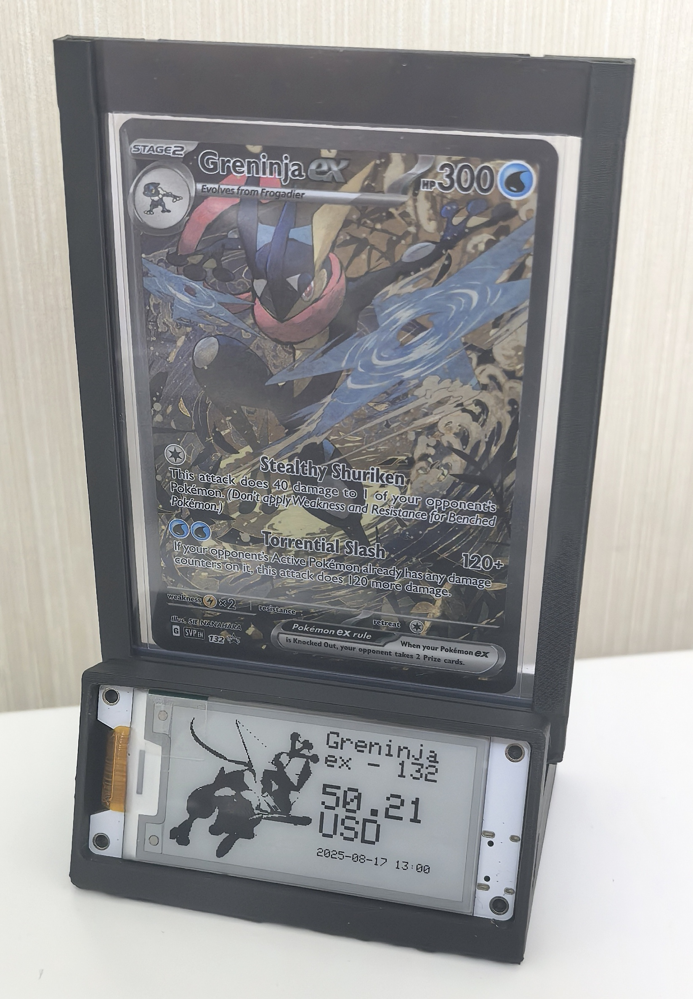

# Wireless Paper 宝可梦价格追踪展示架

给卡友的一个小工具：
它每天抓一次**当天的宝可梦卡牌价格**，合并成一份统一的 `CSV`，任何人都能直接用。
我的 **Wireless Paper（ESP32-S3 电子墨水屏）** 每 24 小时联网读这份 CSV，按 `productId` 显示卡名 + `marketPrice (USD)` + 抓取时间；左半屏还能放一张自己托管的黑白图（比如心爱的主站）。
---

## 它每天都在做什么

* 每天定时抓取价格数据 → 清洗合并 → 更新仓库里的 **`cards/pokemon_cards.csv`**。
* 设备上电：连 Wi-Fi → NTP 校时 → 下载左半图（XBM）→ 流式扫描 CSV（不整文件入内存）→ 显示目标 `productId` 的价格 → 深睡 24 小时。
* 目标是“**省电、稳、少内存**”，适合做个不会吵人的价格小看板。

<a href="example.jpg">
  
</a>

---

## 数据来源与格式

**来源**

* 价格来自第三方聚合站点 **TCGCSV**（整合自 TCGplayer 等公开数据）。
* 产品字典包含 `productId / setName / productName / rarity / subTypeName` 等字段，由你维护或据公开资料生成。

> 说明：第三方数据可能不完整或会变动，仅用于学习与个人项目。

**最终标准 CSV**（设备与下游都读取这一份）
路径：`cards/pokemon_cards.csv`
字段顺序固定：

```
productId,setName,productName,rarity,subTypeName,marketPrice,midPrice,lowPrice,highPrice
644279,ME01: Mega Evolution,Mega Evolution Elite Trainer Box [Mega Gardevoir],,Normal,109.38,109.56,109.0,140.0
```

* 固件逐行扫描首列 **`productId`**（字符串匹配）。
* 屏幕显示 **第 3 列 `productName`** 和 **第 6 列 `marketPrice`（USD）**。

---

## 想直接用我的 CSV？

没问题。

* Raw 地址：

  ```
  https://raw.githubusercontent.com/LuckyDogzyc/HeltecTestFolder/refs/heads/main/cards/pokemon_cards.csv
  ```
* 如果直连不稳（大陆网络），可以用镜像：

  ```
  https://ghfast.top/https://raw.githubusercontent.com/LuckyDogzyc/HeltecTestFolder/refs/heads/main/cards/pokemon_cards.csv
  ```

你可以把它导入表格、脚本或自己的显示设备里，按 `productId` 过滤即可。

---

## 本地一键跑（想自己合并数据的卡友）

脚本都在仓库里，按顺序执行即可。

**准备依赖（Windows PowerShell 示例）**

```powershell
python -m pip install -U requests pandas
```

**1) 下载当天价格（推荐 both 模式，提高兼容性）**

```powershell
python scripts\download_tcgcsv.py --out ".\data" --mode both --game pokemon
```

**2) 合并到标准 CSV**

```powershell
python scripts\merge_pokemon_prices.py ^
  --products .\cards\Products.csv ^
  --prices   ".\data\YYYY-MM-DD\<某个子目录>\price" ^
  --output   .\cards\pokemon_cards.csv
```

小贴士：`--prices` 指向当日下载产物里的 `price` 文件（无扩展名）。`--output` 建议直接写到 `cards/pokemon_cards.csv`，设备和他人就能马上用。

---

## GitHub Actions：让它每天自动跑

在仓库里放一份 `.github/workflows/daily-prices.yml`：

```yaml
name: daily-prices

on:
  schedule:
    - cron: "5 0 * * *"   # 每天 00:05 UTC（可改）
  workflow_dispatch:

jobs:
  build:
    runs-on: ubuntu-latest
    permissions:
      contents: write
    steps:
      - uses: actions/checkout@v4

      - name: Setup Python
        uses: actions/setup-python@v5
        with:
          python-version: "3.11"

      - name: Install deps
        run: |
          python -m pip install -U requests pandas

      - name: Download daily prices (TCGCSV)
        run: |
          python scripts/download_tcgcsv.py --out "./data" --mode both --game pokemon

      - name: Merge Products + Prices -> cards/pokemon_cards.csv
        run: |
          python scripts/merge_pokemon_prices.py \
            --products "./cards/Products.csv" \
            --prices   "$(ls -d ./data/*/* | head -n 1)/price" \
            --output   "./cards/pokemon_cards.csv"

      - name: Commit & push if changed
        run: |
          git config user.name  "github-actions[bot]"
          git config user.email "github-actions[bot]@users.noreply.github.com"
          if ! git diff --quiet; then
            git add cards/pokemon_cards.csv
            git commit -m "chore: daily prices $(date -u +'%Y-%m-%d')"
            git push
          else
            echo "No changes."
          fi
```

这样每天都会把最新价格写回仓库，设备与其他使用者都能直接读最新的 CSV。

---

## 设备部署（Wireless Paper / ESP32-S3）

固件在：

```
arduino/price_monitor_github_with_xbm_fix3/price_monitor_github_with_xbm_fix3.ino
```

**它会做：**
连 Wi-Fi → NTP → 下载左半图（XBM）→ 流式读取 `cards/pokemon_cards.csv` → 按 `productId` 显示卡名和 `marketPrice (USD)` → 深睡 24 小时。

**我这边的默认设置：**

```cpp
// Wi-Fi & 目标卡（按需修改）
static const char* WIFI_SSID     = "2604";
static const char* WIFI_PASSWORD = "19980131";
static const char* TARGET_PRODUCT = "562018";

// CSV（通过 ghfast 镜像访问 GitHub Raw）
static const char* CSV_HOST = "ghfast.top";
static const char* CSV_PATH = "/https://raw.githubusercontent.com/LuckyDogzyc/HeltecTestFolder/refs/heads/main/cards/pokemon_cards.csv";

// 左半黑白图（XBM）
static const char* IMAGE_HOST = "ghfast.top";
static const char* IMAGE_PATH = "/https://raw.githubusercontent.com/LuckyDogzyc/HeltecTestFolder/refs/heads/main/images/Greninja1/Greninja1.xbm";
```

**编译环境要点：**

* Arduino IDE 2.x
* 板卡：安装 **Heltec ESP32**，选择 Wireless Paper（ESP32-S3）对应板型
* 库：`heltec-eink-modules`、`WiFi`、`WiFiClientSecure`、`HTTPClient`（后两者通常随核心）
* 串口 115200 观察日志（NTP、IMG、HTTP、PARSE）

**左半图（XBM）怎么来？**
用 `scripts/convert_to_xbm.py` 把彩色图转为 **125×122** 的 1 位黑白 XBM，放到 `images/...` 并用 Raw 链接让设备下载。
如果黑白倒置或纯白，代码里有三个开关可调：`INVERT_OUTPUT`、`XBM_BLACK_IS_ONE`、`XBM_BIT_LSB_FIRST`。

> 屏幕是黑白 E-Ink，不支持灰阶；旋转后可用区域约 250×122，项目里左半默认 125×122。

---

## 常见问题（卡友实测小记）

* **HTTP -1 / 连接被拒**：先看 NTP 是否成功（TLS 依赖时间）；Raw 路径大小写要对；直连不稳就用 `ghfast.top`。
* **找不到 `productId`**：确认在 `pokemon_cards.csv` 的第一列确实有对应 id，且没有多余空格/引号。
* **左半纯白/反相**：切换上面提到的三个开关，很快能对上。
* **只想右半变、左半不动**：这块屏不支持局部刷新，当前是全屏刷新策略。

---

## 许可证

脚本与固件用于学习与个人项目；第三方数据按其平台条款。需要的话你可以在仓库里加上 MIT / Apache-2.0 等许可证文件。

---

如果你也在做宝可梦的价格面板或展示台，欢迎提 PR 或开 Issue 交流思路。愿你不见颓高、不见男人！
